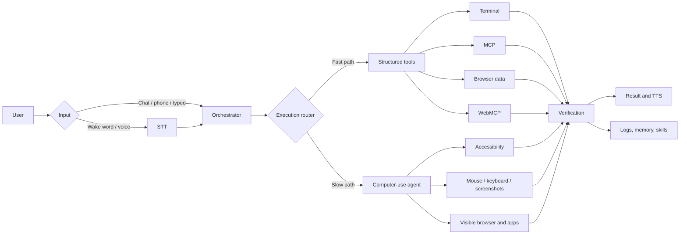
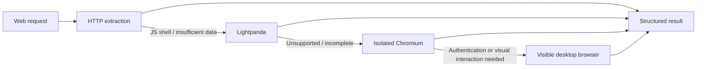

# Personal Computer Use Agent

A voice- and chat-driven agent that can understand your desktop, operate apps,
use the terminal, retrieve web data, call MCP/WebMCP tools, and remember useful
context. It is built primarily for macOS; its `pyautogui` executor can also be
adapted for Windows and Linux.

## Demo

<p align="center">
  <a href="https://youtu.be/j0y-5g9Z_FU">
    
  </a>
  <br />
  <a href="https://youtu.be/j0y-5g9Z_FU"><strong>▶ Watch demo on YouTube</strong></a>
</p>

## What it can do

- Accept commands through a wake word, chat, typed tasks, or a companion phone app.
- Control desktop applications with screenshots, Accessibility, mouse, and keyboard.
- Prefer faster structured paths: terminal, MCP, public webpage extraction, and WebMCP.
- Escalate browser work from HTTP to Lightpanda, isolated Chromium, and visible UI.
- Route requests through fast/slow paths and specialist execution lanes.
- Learn reusable skills and recipes from completed or observed workflows.
- Store personal, application, and screen memories.
- Stream STT/TTS, support barge-in, and identify enrolled speakers.
- Save user-facing files under `~/Documents/Computer Use Agent/` by default.

## Architecture



### Browser escalation



WebMCP uses a persistent isolated Chromium page during a multi-step workflow,
so page state survives consecutive tool calls. It does not inherit cookies from
the user's signed-in browser.

## Quick start

```bash
git clone https://github.com/bchhabra2490/computer-use-agent.git
cd computer-use-agent
python3 -m venv .venv
source .venv/bin/activate
pip install -r requirements.txt
cp .env.example .env
```

Add at least `OPENAI_API_KEY` to `.env`, then start the background orchestrator:

```bash
./cua start
./cua status
./cua stop
```

The first start installs a `cua` shim when possible. If it is not on `PATH`,
continue using `./cua` from the repository.

### Required macOS permissions

Grant the terminal or IDE running the agent:

- **Screen Recording** for screenshots.
- **Accessibility** for UI inspection and input.
- **Microphone** for voice commands.
- **Automation** for reading supported browser tabs.

Restart that application after granting permissions.

## Common commands

```bash
cua start                         # start voice orchestrator in the background
cua restart
cua status
cua stop
cua sleep on                      # temporarily ignore wake words
cua sleep off
cua chat on                       # open the Electron chat app
cua face jarvis                   # select a face overlay

python orchestrator.py --auto     # foreground voice mode
python agent.py "Open Notes"      # typed task with confirmations
python agent.py --auto "Open Notes and write today's date"
```

`--auto` skips per-step confirmations. Do not use it unattended for payments,
messages, credentials, deletion, or other consequential actions.

### Workflow observer

`cua observe` is a separate, opt-in process. It records inexpensive app/window/
URL context and interaction samples, then proposes memories and reusable skills.
Nothing enters durable memory until accepted.

```bash
cua observe start
cua observe list
cua observe accept <draft-id> m1 s1
cua observe accept --all
cua observe reject --all
cua observe stop
```

Password managers are skipped, and the observer pauses while the agent controls
the pointer. Drafts live under `.runtime/observe/proposed/`.

## Voice and models

The defaults and all supported options are documented in `.env.example`.

| Capability | Default | Alternatives |
|---|---|---|
| Orchestrator | `gpt-5-mini` | DeepSeek-compatible backend |
| Computer agent | Difficulty-based Luna/Terra/Sol routing | `AGENT_MODEL` override |
| STT | OpenAI live transcription | Sarvam, local WhisperFlow |
| TTS | OpenAI streaming TTS | Sarvam, Piper, Kokoro |
| Wake word | Local openWakeWord | API phrase matching |

Useful settings include `STT_PROVIDER`, `TTS_PROVIDER`, `WAKE_PHRASE`,
`WAKE_THRESHOLD`, `ORCHESTRATOR_MODEL`, `AGENT_MODEL`, and `EVAL_EVERY`.

Say the configured wake phrase, speak a request, and say **over and out** to end
capture. Say the wake phrase during speech to interrupt. Agent questions can be
answered directly without repeating the wake phrase.

## Chat and phone access

The menu-bar app exposes live state, logs, sleep mode, chat, face/log overlays,
screen-memory capture, and task cancellation.

Install the chat UI once:

```bash
cd chat_app
npm install
cd ..
cua chat on
```

The optional phone gateway accepts text, audio, and photos and streams agent
status over HTTP/SSE:

```bash
PHONE_GATEWAY=1 python orchestrator.py --auto
```

It prints LAN URLs and stores its bearer token in `.runtime/phone.token`.
Use the companion [Jarvis Remote app](https://github.com/bchhabra2490/computer-use-mobile-app)
for the intended mobile experience.

## Browser, MCP, skills, and memory

### Browser tools

- `browser_data`: safe public-page Markdown, focused extraction, and links.
- `browser_webmcp`: structured tools exposed by HTTPS pages.
- Browser automation: isolated headless Chromium with visible-browser fallback.

Page content and WebMCP metadata are untrusted. Mutating WebMCP tools require an
explicitly authorized action.

### MCP integrations

```bash
cua mcp login linear
cua mcp login github
cua mcp login notion
cua mcp status
cua mcp logout linear
```

Connections are configured in `mcp.json`; credentials are kept under
`.runtime/mcp-auth/`. Restart the orchestrator after changing authentication.
Set `MCP_READ_ONLY=1` to block MCP writes.

### Skills and recipes

- `skills/<name>/SKILL.md` contains reusable playbooks.
- `recipes/*.json` contains fast parameterized workflow prefixes.
- Successful agent runs can propose new skills automatically.

```bash
cua skills condense --dry-run
cua skills condense
cua skills merge --dry-run
cua skills merge
```

### Memory and logs

Durable memories are organized under `memory/personal/`, `memory/apps/`, and
`memory/screens/`. Disable automatic extraction or condensation with
`MEMORY_EXTRACT=0` or `MEMORY_CONDENSE=0`.

Each task writes a trace under `logs/<timestamp>_<task>/`, including tool calls,
results, routing decisions, and available user feedback.

## Output files

Files created, downloaded, exported, or generated for the user go to:

```text
~/Documents/Computer Use Agent/
```

An explicitly requested destination takes precedence. Set `AGENT_OUTPUT_DIR` to
change the global default. Internal logs, runtime state, and memory remain in
their project-managed locations.

## Safety and privacy

- Move the pointer into any screen corner to trigger the `pyautogui` fail-safe.
- Use **Mark Task Done**, voice interruption, or `Ctrl+C` to stop active work.
- Keep confirmation enabled for consequential actions.
- Treat terminal access as full local shell access.
- Browser-data and WebMCP backends use isolated profiles, not personal cookies.
- Keep `.env`, `mcp.json`, `.runtime/`, recordings, and logs out of source control.
- Review observer drafts before accepting them into memory or skills.

## Project map

| Area | Main files |
|---|---|
| Voice orchestration | `orchestrator.py`, `stt/`, `tts/`, `wake.py` |
| Computer execution | `agent.py`, `actions.py`, `accessibility.py` |
| Routing and evaluation | `execution_router.py`, `evaluator.py` |
| Browser | `browser_data.py`, `webmcp.py`, `webmcp_chromium.mjs` |
| Integrations | `mcp_client.py`, `mcp_auth.py`, `mcp.json` |
| Chat and phone | `chat_app/`, `chat_bridge.py`, `phone_gateway.py` |
| Learning and context | `observe.py`, `skills.py`, `memory.py`, `recipes.py` |
| Runtime interface | `cua.py`, `status_tray.py`, `face_overlay.py` |

## Companion projects

- [computer-use-mobile-app](https://github.com/bchhabra2490/computer-use-mobile-app) — phone remote for text, voice, photos, status, and replies.
- [computer-use-hardware](https://github.com/bchhabra2490/computer-use-hardware) — ESP32, MQTT, and MCP-based physical-device control.

## License

Open source under the [MIT License](LICENSE).
